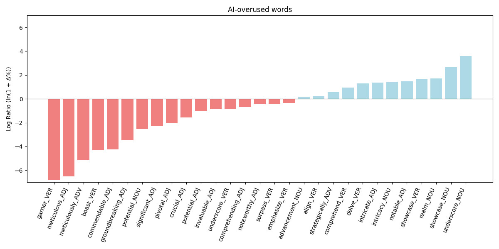

# AI-Associated Words: Frequency Analysis of Instruction Tuning Datasets vs Baseline Scientific English

## Overview

The literature, when stating that overused words are not present in the training data, has yet to separately analyze data used for pre-training (training Large Language Models on vast amounts of text data) and data used for instruction tuning (training LLMs on data that makes them more useful as chat assistants). It was shown that for the domain of Scientific English, overused words (such as *delve* and *intricate*) are not present in likely pre-training data. This leaves open the possibility that these words are introduced into the models during instruction tuning.

## Datasets

Thus, as a sanity check, we analyzed three popular instruction tuning datasets:

1. [aya English Instruct (2024)](https://huggingface.co/datasets/CohereLabs/aya_dataset)
2. [Dolly (2023)](https://huggingface.co/datasets/databricks/databricks-dolly-15k)
3. [OASST1 English (2023)](https://huggingface.co/datasets/OpenAssistant/oasst1)

We combined these into a single dataset for analysis (0.7 million tokens). There are other instruction tuning datasets available, but many of them include AI-generated content and were therefore excluded from this analysis.

As a baseline, we used all PubMed abstracts from the year 2020 (337.6 million tokens), i.e. data from prior to the release of ChatGPT. Both datasets were part-of-speech tagged using the same methodology as described in the main paper. All analyses were performed on base forms (lemmas).

## Analysis

We used the list of 34 overused words identified in Galpin et al. (2025). Of these, 29 occurred in the PubMed 2020 dataset and were included in our analysis here.

PubMed 2020 abstracts serve as the baseline. We measured the relative change in normalized frequencies (occurrences per million words; *opm*) in the combined instruction dataset. A chi-square test was performed for each word to test for statistically significant differences, this test is well suited to the data structure. 

## Expectations

This is a cross-domain comparison, so substantial differences are to be expected, regardless of whether instruction tuning contributes to lexical overuse. 

If the instruction tuning datasets were not a significant source of lexical overuse in academic texts (H0), we would expect exactly that: notable variation when comparing instruction data to a human-authored baseline (PubMed abstracts), with some words appearing considerably more often, and others considerably less. 

However, if instruction tuning is a source of lexical overuse in academic English as produced by LLMs (H1), we would expect a clear majority of the words in question to appear significantly more often in the instruction tuning datasets than in the human baseline.

## Results

The table below lists the part-of-speech-tagged base form (lemma), the percentage change between PubMed and instruction tuning datasets, opm values for each, and whether the difference is statistically significant.

| Lemma_POS           | Change (%) | OPM (PubMed) | OPM (Instruct) | Significant |
|---------------------|------------|--------------|----------------|-------------|
| underscore_NOUN     | 3496.88    | 0.08         | 2.77           | TRUE        |
| showcase_NOUN       | 1338.75    | 0.19         | 2.77           | TRUE        |
| realm_NOUN          | 458.88     | 2.23         | 12.46          | TRUE        |
| showcase_VERB       | 426.37     | 3.16         | 16.62          | TRUE        |
| notable_ADJ         | 333.50     | 14.06        | 60.94          | TRUE        |
| intricacy_NOUN      | 323.16     | 0.65         | 2.77           | FALSE       |
| intricate_ADJ       | 285.30     | 5.03         | 19.39          | TRUE        |
| delve_VERB          | 262.48     | 0.76         | 2.77           | FALSE       |
| comprehend_VERB     | 154.68     | 2.72         | 6.92           | FALSE       |
| strategically_ADV   | 73.18      | 1.60         | 2.77           | FALSE       |
| align_VERB          | 24.30      | 18.94        | 23.54          | FALSE       |
| advancement_NOUN    | 17.83      | 21.16        | 24.93          | FALSE       |
| emphasize_VERB      | -30.12     | 37.66        | 26.31          | FALSE       |
| surpass_VERB        | -32.82     | 4.12         | 2.77           | FALSE       |
| noteworthy_ADJ      | -36.77     | 4.38         | 2.77           | FALSE       |
| comprehending_ADJ   | -50.00     | 0.01         | 0.00           | FALSE       |
| underscore_VERB     | -56.90     | 12.85        | 5.54           | FALSE       |
| invaluable_ADJ      | -58.32     | 3.32         | 1.38           | FALSE       |
| potential_ADJ       | -63.97     | 476.63       | 171.73         | TRUE        |
| crucial_ADJ         | -78.82     | 104.62       | 22.16          | TRUE        |
| pivotal_ADJ         | -87.18     | 21.61        | 2.77           | TRUE        |
| significant_ADJ     | -89.92     | 934.09       | 94.17          | TRUE        |
| potential_NOUN      | -92.12     | 333.79       | 26.31          | TRUE        |
| groundbreaking_ADJ  | -96.88     | 0.09         | 0.00           | FALSE       |
| commendable_ADJ     | -98.55     | 0.20         | 0.00           | FALSE       |
| boast_VERB          | -98.65     | 0.22         | 0.00           | FALSE       |
| meticulously_ADV    | -99.43     | 0.52         | 0.00           | FALSE       |
| meticulous_ADJ      | -99.85     | 2.01         | 0.00           | FALSE       |
| garner_VERB         | -99.89     | 2.63         | 0.00           | FALSE       |

An illustration of the results can be found in the figure below.

## Discussion

We find no conclusive evidence that words overused by AI are also overused in human-created instruction tuning datasets. Accordingly, we interpret this as suggesting that the overuse is unlikely to originate in human-written instruction tuning data.

## References

Galpin, R., Anderson, B., & Juzek, T. S. (2025, May). *Exploring the Structure of AI-Induced Language Change in Scientific English*. In *The International FLAIRS Conference Proceedings* (Vol. 38).

## Visualization

